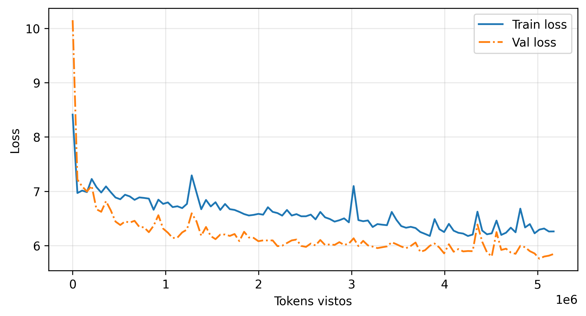

# Foundation Model

Pretraining of a **GPT-2 small (124M)** model from scratch in PyTorch,
following the book *Build a Large Language Model From Scratch*
(Sebastian Raschka).

## Model configuration

| Parameter      | Value  |
|----------------|--------|
| vocab_size     | 50,257 (GPT-2 tokenizer) |
| context_length | 256 (verdict) / 1024 (fineweb) |
| emb_dim        | 768    |
| n_heads        | 12     |
| n_layers       | 12     |
| drop_rate      | 0.0 (no dropout during pretraining) |
| qkv_bias       | False  |

~162M trainable parameters.

## Files

- `pretraining.py` — everything needed to train: datasets
  (`The Verdict` or `FineWeb-Edu` in streaming), dataloaders, loss,
  training loop, sample generation, and a CLI entry point.
- `Transformer_arquitectures.py` — `TransformerBlock` and `GPTModel`.
- `attention_mechanisms.py` — multi-head causal attention (Q/K/V),
  `LayerNorm`, `GELU`, `FeedForward`.
- `helper_functions.py` — token-level generation with temperature scaling
  and top-k sampling.
- `Pre_train_LLM_124M .ipynb` — Colab notebook that trains on
  `codelion/fineweb-edu-1B` (streaming) and saves checkpoints to Drive.
- `load_model.ipynb` — loads a saved checkpoint, runs a short inference
  and measures generation speed in tokens per second.
- `Training_data.md` / `loss_curve.png` — logs and plot of a real run.

## How to run

```bash
# The Verdict (10 epochs, quick, no extra dependencies)
python pretraining.py

# FineWeb-Edu in streaming (requires: pip install datasets)
python pretraining.py --dataset fineweb --max_docs 5000 --epochs 1

# Force CPU
python pretraining.py --epochs 5 --device cpu
```

The script saves the trained weights to `gpt2-pretrained.pth`.

## Current state

- Trained **1 epoch on FineWeb-Edu** (streaming), ~5.2M tokens seen
  (5000 documents, batch 2 x 256 tokens), ~10,100 steps.
- Loss went from **8.41 → 6.26 (train)** and **10.15 → 5.81 (val)**.
- The loss curve is healthy (val < train, no overfitting) but the model is
  still **under-trained**: for a 124M model the loss should go much lower
  with more data. Next steps: train on more documents, longer context, or
  more epochs.
- Inference speed: **~33 tokens/s** for the 124M model on CPU (measured in
  `load_model.ipynb` with `tokens_per_second`).



## Notes

- The `.pth` checkpoints are git-ignored (add the training script's output
  folder if you want to version them).
- All code comments and docs are in English.
