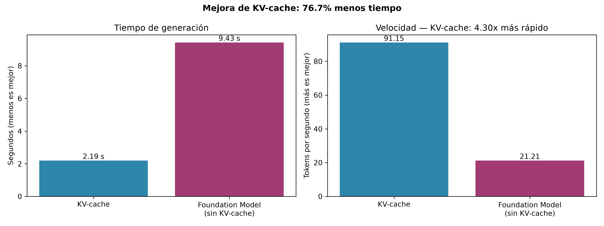
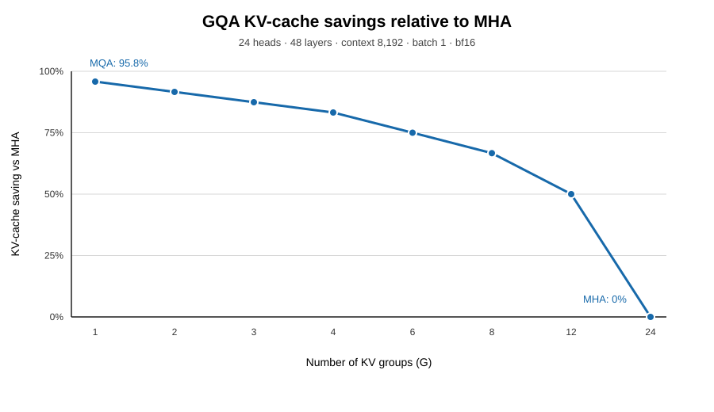

# Optimization techniques

The optimization package extends the base GPT components with cached decoding,
grouped-query attention (GQA), and sparse mixture-of-experts (MoE) blocks.

## Code layout

| Module | Purpose |
| --- | --- |
| `llm_mini_lab.optimization.attention` | Multi-head and grouped-query attention with KV-cache support |
| `llm_mini_lab.optimization.model` | Cache-aware GPT and GQA-GPT architectures |
| `llm_mini_lab.optimization.generation` | Greedy generation with and without cached decoding |
| `llm_mini_lab.optimization.moe` | Routers, experts, sparse MoE, and a transformer block |

The base `LayerNorm`, `GELU`, and `FeedForward` implementations are imported
from `llm_mini_lab.attention`; they are no longer duplicated.

## KV cache

During autoregressive generation, keys and values from earlier tokens do not
change. Cached decoding stores them and processes only the newly generated
token. For `L` layers, batch size `B`, context length `T`, `H_kv` key/value
heads, head dimension `d_h`, and `s` bytes per element:

```text
KV-cache bytes = 2 × L × B × T × H_kv × d_h × s
```

The recorded experiment improved throughput from 21.21 to 91.15 tokens per
second, a 4.30× increase.



## Grouped-query attention

GQA shares key/value projections among groups of query heads. If regular MHA
has `H` heads and GQA uses `G` key/value groups:

```text
GQA cache / MHA cache = G / H
GQA saving vs MHA     = 1 - G / H
```



See [GQA notes](gqa.md) and the notebooks under `notebooks/optimization/`.

To regenerate the memory-saving chart, run:

```bash
python scripts/plot_kv_cache_savings.py
```

Call `model.reset_kv_cache()` before starting a new prompt when using the
cache-aware model API directly.
